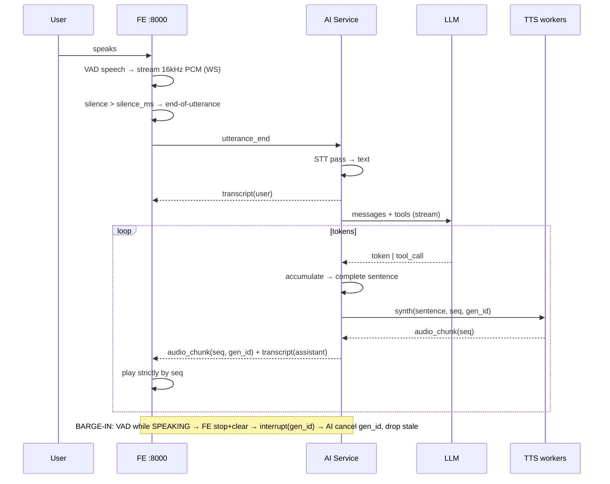

# SPEC v2.0 — AI Voice E2E Assistant (Kiosk Receptionist)

> **Status:** Implementation-ready · **Primary target:** NVIDIA GB10 (ARM + CUDA) · **Dev/Demo:** Apple M4
> A low-latency, end-to-end voice conversational kiosk acting as a virtual receptionist in a building lobby. Vietnamese + English, runs locally on a single device, packaged with Docker / Compose.
> This version adds **Personas, User Stories and testable Acceptance Criteria per phase** (§17).

---

## 1. Overview & Goals

End-to-end voice loop **mic → STT → LLM (tool-calling) → TTS → speaker** with low latency and **barge-in**. The visitor picks a language on the landing page with one click and talks immediately.

### Core design principles
- **One language per session** → only the chosen STT + TTS are exercised. GB10 preloads all models at boot; M4 lazy-loads.
- **AI service is a swappable unit** to absorb GB10 (CUDA) vs M4 (MPS/CPU) differences.
- **System prompt + DB + tool schemas in English.** Voice I/O follows the user-selected language.
- **Domino TTS:** stream LLM output → split into sentences → synthesize each as it completes → play in order; sentence *N+1* is generated while *N* plays.
- **OpenAI-compatible LLM endpoint** (`OPENAI_BASE_URL`) → future self-hosted **vLLM** is a config swap.

---

## 2. Scope

**In-scope:** Voice Agent Web (`:8000`), AI service (`:7700` WS), BE (`:9000`) as stubs + mock data, PostgreSQL seeded with mock data, Docker/Compose with a GPU profile for GB10.

**Out-of-scope (later):** Admin web, face recognition, multi-user concurrency, self-hosted vLLM (design-ready only).

---

## 3. Locked decisions

| # | Decision |
|---|---|
| HW | **GB10 = production**, M4 = dev/test/demo. Optimize for GB10 (CUDA + Docker `--gpus`). |
| Transport | **WebSocket** (binary audio + JSON events). No WebRTC. Browser-side AEC. |
| STT mode | **Endpoint-then-transcribe.** |
| TTS | **Default model voices** — no cloning. Domino sentence pipelining. |
| LLM | OpenAI API now; OpenAI-compatible base URL → vLLM later. |
| Business APIs | BE **stubs + mock data**; pre-built request functions; integrate later. |
| KB | Mock data; **full-text search**; move to DB later. |
| Appointments | General-purpose visit booking (name, phone, time, general purpose). |
| Session end | **30s idle** + **End button** + **"goodbye" intent**. |
| DB | Single device; **PostgreSQL** in Compose, seeded with mock data. |

---

## 4. Personas

| Persona | Description | Needs |
|---|---|---|
| **Visitor (Khách)** | Walk-in guest, may not be tech-savvy, public. | Quick info, directory lookup, book a visit appointment — all by voice. |
| **Employee (Nhân viên)** | Staff member of the building. | Book a meeting room after identity verification. |
| **Building Operator** | Runs/maintains the kiosk on-site. | Reliable kiosk, easy reset, graceful failure, deploys via Docker on GB10. |
| **Developer / Integrator** | Builds & maintains the system. | Clear contracts, swappable engines, observable latency, mockable BE. |
| **(Later) Admin** | Manages content & data. | Will populate DB / Q&A and view usage. *Out of scope this release.* |

---

## 5. Architecture

```
┌──────────────────────────────────────────────────────────────────────┐
│  DEVICE — NVIDIA GB10 (prod) / Apple M4 (dev)                          │
│                                                                        │
│  ┌──────────────────────────────┐                                      │
│  │  FE — Voice Agent  :8000      │   (single kiosk browser, same LAN)   │
│  │  Landing · Avatar+chatbox     │                                      │
│  │  Dynamic interaction panel    │                                      │
│  │  Mic capture + VAD            │                                      │
│  │  Ordered audio playback       │                                      │
│  └─────────────┬────────────────┘                                      │
│                │ WebSocket: binary PCM ↑ / audio chunks ↓ + JSON events │
│                ▼                                                        │
│  ┌────────────────────────────────────────────────────────────────┐   │
│  │  AI SERVICE (Python async)  ws :7700                             │   │
│  │  gateway → VAD endpoint → STT → LLM(stream+tools)                │   │
│  │     → sentence splitter → TTS worker pool → ordered out queue    │   │
│  │  shared/: schemas · be_client · deps · prompts · audio           │   │
│  └──────────────┬───────────────────────────────┬─────────────────┘   │
│                 │ HTTP (tool calls)              │ HTTPS (OpenAI-compat)│
│                 ▼                                ▼                      │
│  ┌──────────────────────────────┐      ┌──────────────────────────┐    │
│  │  BE (FastAPI) :9000           │      │  LLM: OpenAI → vLLM      │    │
│  │  stubs + mock data            │      └──────────────────────────┘    │
│  └──────────────┬───────────────┘                                      │
│                 ▼  PostgreSQL (seeded mock)                             │
└────────────────────────────────────────────────────────────────────────┘
```

**Ports:** FE `8000`, AI WS `7700`, BE `9000`, Postgres `5432`.

---

## 6. Models & Runtime

| Module | Model | Runtime | GB10 | M4 (demo) | License |
|---|---|---|---|---|---|
| STT-VI | `g-group-ai-lab/gipformer-65M-rnnt` | ONNX via **sherpa-onnx** | CPU/CUDA RT | CPU RT | MIT |
| STT-EN | `nvidia/parakeet-tdt-0.6b-v3` | **NeMo** | CUDA RT | CPU/MPS slower | CC-BY-4.0 |
| TTS-VI | `kjanh/KhanhTTS-OmniVoice` (default voice) | PyTorch diffusion | CUDA near-RT | slower | apache-2.0* |
| TTS-EN | **ChatterBox / Turbo** (default voice) | PyTorch | CUDA >RT | OK | MIT |

\* TTS-VI card is research-use; commercial licensing handled separately. STT 16 kHz mono in; TTS 24 kHz out; AI service resamples.

---

## 7. Real-time turn lifecycle



**Barge-in:** while `SPEAKING`, sustained VAD (≥ `barge_in_min_ms`) → FE stops + clears queue → `interrupt(gen_id)` → AI cancels LLM stream + TTS jobs for that `gen_id`, drops stale chunks → `LISTENING`.

**Echo handling:** browser AEC (`echoCancellation/noiseSuppression/autoGainControl`) → raise VAD threshold during `SPEAKING` → reference-signal AEC later if hardware needs it.

---

## 8. Session state machine

```
LANDING ──(click EN/VI)──► GREETING ──► LISTENING ⇄ THINKING ⇄ SPEAKING
   ▲                                          │           │         │
   │                                          └─ barge-in ┴─────────┘
   └── IDLE_TIMEOUT(30s) / "goodbye" / End button ◄────────────────┘
              (reset, wipe transient PII, return to LANDING)
```

Session object: `session_id, language, state, conversation[], slot_state, gen_id`.

---

## 9. Functions, Tools & Schemas

Tool-calling; voice slot-filling; **read-back confirmation before any commit**.

**Info (Q&A):** `search_knowledge_base(query) -> KBHit[]` (full-text on mock).
**Directory:** `lookup_directory(query) -> DirectoryEntry[]`.
**Conversation control:** `end_conversation(reason)`.

**Meeting-room booking (employees only):**
```python
class EmployeeVerification(BaseModel):
    full_name: str; employee_code: str
class MeetingBookingRequest(BaseModel):
    title: str; room_name: str
    start_time: datetime; end_time: datetime
    notes: str | None = None; participants: list[str] = []
    organizer_employee_code: str
```
- `verify_employee(...) -> {verified, employee_id}`
- `get_room_status(date, time_range, room_name?) -> RoomSlot[]`
- `create_meeting(MeetingBookingRequest) -> {booking_id, status}`

**Visitor appointment (general):**
```python
class AppointmentRequest(BaseModel):
    visitor_name: str; phone_number: str
    desired_time: datetime; purpose: str | None = None
```
- `check_appointment_availability(desired_time, ...) -> Slot[]`
- `create_appointment(AppointmentRequest) -> {appointment_id, status}`

**Normalization:** spoken date/time → ISO; phone/employee code → digits; names spellable — all read back to confirm.

---

## 10. BE API contract (stubs + mock data)

| Method | Path | Purpose |
|---|---|---|
| POST | `/employees/verify` | Verify name + code |
| GET  | `/rooms/status` | Room availability |
| POST | `/rooms/book` | Create booking |
| GET  | `/appointments/availability` | Open slots |
| POST | `/appointments` | Create appointment |
| GET  | `/kb/search` | Full-text consulting search |
| GET  | `/directory` | Department/building lookup |
| POST | `/sessions/log` | Usage session log |

Envelope: `{ data, error, request_id }`. Every endpoint returns seeded mock data; request/response functions built now for drop-in real integration later.

---

## 11. Folder structure

```
project-root/
├── ai/  (main.py · orchestrator/{pipeline,sentence_splitter,state}
│         services/{stt,tts,llm} · shared/{schemas,be_client,deps,prompts,audio} · models/)
├── be/  (main.py · routers/ · models/ · schemas/ · db/{migrations,seed})
├── fe/voice-agent/ (pages/Landing · components/{Avatar,ChatBox,InteractionPanel}
│                    audio/{vad,capture,player} · ws/client)
├── docker/ (Dockerfile.ai|be|fe · compose.yaml [profiles: gpu|cpu])
├── .env.template
└── README.md
```

---

## 12. `.env.template`

```dotenv
OPENAI_API_KEY=
OPENAI_BASE_URL=https://api.openai.com/v1     # later: http://vllm:8000/v1
OPENAI_MODEL=gpt-5.4-nano                       # configurable; verify real id
LLM_TEMPERATURE=0.4
LLM_MAX_TOKENS=512
STT_VI_MODEL_PATH=/models/gipformer-65M-rnnt
STT_EN_MODEL_PATH=/models/parakeet-tdt-0.6b-v3
STT_DEVICE=auto
TTS_VI_MODEL=kjanh/KhanhTTS-OmniVoice
TTS_EN_ENGINE=chatterbox-turbo
TTS_DEVICE=auto
TTS_SAMPLE_RATE=24000
VAD_SILENCE_MS=800
VAD_MIN_SPEECH_MS=250
VAD_THRESHOLD=0.5
BARGE_IN_MIN_MS=300
AI_WS_PORT=7700
FE_PORT=8000
BE_BASE_URL=http://be:9000
SESSION_IDLE_TIMEOUT_S=30
DATABASE_URL=postgresql://kiosk:CHANGE_ME@db:5432/kiosk
```

---

## 13. Deployment

| Target | FE/BE/DB | AI service | GPU |
|---|---|---|---|
| **GB10 (prod)** | Docker | Docker + `--gpus all` | ✅ CUDA |
| **M4 (dev/demo)** | Docker | Native uvicorn (MPS) or Docker CPU | ⚠️ MPS only outside Docker |

`compose.yaml` profiles `gpu`/`cpu`; `linux/arm64` images; checkpoints via mounted volume. GB10 is the performance-representative environment.

---

## 14. Non-functional requirements

- **Latency (GB10):** STT < 400 ms post-endpoint · LLM first token < 700 ms · TTS first audio < 500 ms/sentence · **first sound < ~1.5 s**.
- **Privacy:** no raw-audio persistence by default; transient PII in session, persisted only on successful booking, wiped on reset/idle; disclose AI-generated audio.
- **Observability:** per-turn stage latencies, tool calls, errors → `/sessions/log`.
- **Resilience:** LLM/network failure → polite fallback; vLLM-fallback-ready.
- **Concurrency:** one active session per device.

---

## 15. UI (port 8000)

Red-on-white theme. Landing: bilingual greeting + `English`/`Tiếng Việt` buttons (one click → conversation). Left: Avatar (static first; talking-state toggle later) + small chatbox history. Right: dynamic interaction panel (room timeslots, appointment confirmation card). Visual listening/thinking/speaking states; **End** button + language switch.

---

## 16. Phase plan (summary)

| Phase | Theme | Exit |
|---|---|---|
| **P0** | Real-time skeleton (stubs) | Voice loop + domino + barge-in proven; latency harness. |
| **P1** | Real models | 4 models integrated; GB10 latency targets met; VAD/echo tuned. |
| **P2** | Business functions | 4 functions working via tools on mock BE; read-back confirms. |
| **P3** | Hardening | Goodbye/idle/End, logging, fallbacks, GB10 packaging. |
| **P4** | Later | Admin web, avatar animation, vLLM, face recognition. |

---

## 17. User Stories & Acceptance Criteria

> Format: **US-P{phase}-{n}**. Acceptance Criteria are Given/When/Then and must be demonstrable. Each phase ends with a **Definition of Done (DoD)**.

### 17.1 Phase P0 — Real-time skeleton

**US-P0-1 — WebSocket transport (Developer)**
*As a developer, I want a binary WebSocket channel between FE and AI so audio frames and control events flow both ways.*
- Given FE loads on `:8000`, when it connects to AI `:7700`, then a WS session opens and a `session_id` is issued.
- Given the channel is open, when FE sends binary PCM frames and JSON events, then AI receives both without loss for a 60-second session.
- Given the network drops, when reconnect occurs, then a new session is created and the old one is garbage-collected within 5 s.

**US-P0-2 — Language landing (Visitor)**
*As a visitor, I want to choose a language in one click and immediately start talking.*
- Given the LANDING page, when I tap `English` or `Tiếng Việt`, then the session enters GREETING within 300 ms and the mic opens.
- Given a language is selected, then it is fixed for the whole session and reflected in all transcripts/events.
- Given GREETING, then a greeting audio (stub allowed) plays in the chosen language before LISTENING.

**US-P0-3 — Capture, VAD & endpointing (Visitor)**
*As a visitor, I want the system to know when I've finished speaking without cutting me off.*
- Given LISTENING, when I speak, then FE-side VAD marks speech start within 200 ms and streams 16 kHz mono PCM.
- Given I pause briefly mid-sentence (< `silence_ms`), then the utterance is NOT ended.
- Given I stop for ≥ `silence_ms` (default 800 ms), then FE emits `utterance_end` exactly once.
- Given background noise below `vad_threshold`, then no false utterance is triggered.

**US-P0-4 — Stub STT round-trip (Visitor)**
*As a visitor, I want my speech turned into text (stubbed) and shown in the chatbox.*
- Given `utterance_end`, when the stub STT runs, then a `transcript{role:user}` event returns and renders in the chatbox.
- Given a transcript, then the same text is forwarded into the LLM/stub stage.

**US-P0-5 — Domino playback with stub TTS (Visitor)**
*As a visitor, I want to hear multi-sentence answers play smoothly in order.*
- Given a stub LLM reply of ≥ 3 sentences, when processed, then the sentence splitter yields ≥ 3 segments each tagged with incremental `seq` and a shared `gen_id`.
- Given segments synthesized by stub TTS, then FE plays them strictly in `seq` order with no audible gaps > 150 ms.
- Given chunks arrive out of order, then playback order remains correct by `seq`.
- Given playback, then while sentence *N* plays, sentence *N+1* is already generated (overlap observable in logs).

**US-P0-6 — Barge-in (Visitor)**
*As a visitor, I want to interrupt the agent at any time and have it stop instantly.*
- Given SPEAKING, when I speak ≥ `barge_in_min_ms` (default 300 ms), then FE stops playback and clears its queue within 200 ms.
- Given an interrupt, then FE sends `interrupt{gen_id}` and AI cancels that `gen_id`'s LLM + TTS work, dropping all stale chunks.
- Given the interrupt completed, then state returns to LISTENING and a new utterance is accepted.
- Given the agent's own audio bleeds into the mic, then no self-interruption occurs (AEC/threshold verified).

**US-P0-7 — Session reset (Visitor / Operator)**
*As a visitor, I want the kiosk to reset for the next person.*
- Given no interaction for `SESSION_IDLE_TIMEOUT_S` (30 s), then the session resets to LANDING.
- Given an **End** button tap, then the session resets immediately to LANDING.
- Given reset, then conversation history and transient state are cleared.

**US-P0-8 — Latency harness (Developer)**
*As a developer, I want per-stage timing for every turn.*
- Given any turn, then logs record timestamps for: utterance_end, STT done, LLM first token, first TTS audio, first FE playback.
- Given a completed session, then a per-turn latency summary is retrievable.

**DoD P0:** Full loop runs end-to-end with stubs on M4 and GB10; domino, barge-in, idle/End reset, and latency logging all demonstrable; CI builds all three images.

---

### 17.2 Phase P1 — Real models

**US-P1-1 — Vietnamese STT (Visitor)**
*As a Vietnamese-speaking visitor, I want my speech accurately transcribed.*
- Given VI session, when I speak a scripted VI sentence set, then gipformer (sherpa-onnx) transcribes with WER ≤ agreed threshold on the internal test set.
- Given regional accents (north/central/south), then transcription remains usable (no crash, graceful degradation).

**US-P1-2 — English STT (Visitor)**
*As an English-speaking visitor, I want my speech transcribed.*
- Given EN session, when I speak a scripted EN sentence set, then parakeet transcribes with WER ≤ agreed threshold.
- Given the EN STT, then it runs on GB10 CUDA; on M4 it falls back (slower) without crashing.

**US-P1-3 — Natural TTS, default voices (Visitor)**
*As a visitor, I want the agent to sound natural in my language.*
- Given a VI reply, then OmniVoice (default voice) renders intelligible 24 kHz audio.
- Given an EN reply, then ChatterBox/Turbo (default voice) renders intelligible 24 kHz audio.
- Given multi-sentence replies, then the domino pipeline still holds (no reordering, gaps > 150 ms).

**US-P1-4 — Audio fidelity (Developer)**
*As a developer, I want correct sample-rate handling across the chain.*
- Given mic input at device rate, then it is resampled to 16 kHz mono for STT without clipping.
- Given 24 kHz TTS output, then it plays at correct pitch/speed on FE.

**US-P1-5 — GB10 latency targets (Developer/Operator)**
*As an operator, I want responses to feel real-time on production hardware.*
- Given GB10, then measured medians meet: STT < 400 ms, LLM first token < 700 ms, TTS first audio < 500 ms/sentence, first sound < ~1.5 s.
- Given the targets are missed, then a documented tuning path exists (engine/quantization/worker count).

**US-P1-6 — VAD & echo tuning (Visitor)**
*As a visitor, I want clean turn-taking without the kiosk talking over itself.*
- Given speaker playback, then false barge-ins occur in ≤ agreed % of turns in a noise test.
- Given configurable VAD params, then they are adjustable via env without code changes.

**DoD P1:** All four models integrated and selected by session language; GB10 meets latency targets (or has a documented gap + plan); audio fidelity verified; VAD/echo tuned; demo works on M4 (English snappy, VI slower as expected).

---

### 17.3 Phase P2 — Business functions

**US-P2-1 — Information consulting (Visitor)**
*As a visitor, I want to ask about the organization/building and get spoken answers.*
- Given an info question, when the LLM calls `search_knowledge_base`, then BE returns full-text matches from mock data.
- Given matches, then the agent answers in the session language, grounded in returned content.
- Given no match, then the agent says it doesn't have that information (no fabrication).

**US-P2-2 — Directory lookup (Visitor)**
*As a visitor, I want to find a department/room/floor.*
- Given a directory query, when `lookup_directory` runs, then department, floor, location and contact are returned and spoken back.
- Given an ambiguous query, then the agent asks one clarifying question.

**US-P2-3 — Employee verification for room booking (Employee)**
*As an employee, I must be verified before booking a meeting room.*
- Given a room-booking intent, then the agent first collects full name + employee code by voice and reads them back to confirm.
- When `verify_employee` returns `verified:false`, then booking is refused politely and not attempted.
- When `verified:true`, then the flow proceeds and `organizer_employee_code` is bound to the booking.

**US-P2-4 — Collect & validate meeting slots (Employee)**
*As an employee, I want to provide booking details by voice.*
- Given verification passed, then the agent collects required fields (title, room, start/end time) and optional (notes, participants) into `MeetingBookingRequest`.
- Given spoken date/time, then it is normalized to ISO and **read back** for confirmation.
- Given a missing required field, then the agent asks for it (one field per turn) and does not proceed until complete.

**US-P2-5 — Check availability & confirm (Employee)**
*As an employee, I want to be offered a valid timeslot.*
- Given complete details, when `get_room_status` runs, then available slots are returned.
- Given the requested time is taken, then the agent proposes the closest viable slot(s) and asks the employee to choose.
- Given the employee confirms a slot, then and only then is `create_meeting` called.

**US-P2-6 — Create meeting booking (Employee)**
*As an employee, I want my booking created and confirmed.*
- When `create_meeting` succeeds, then the agent confirms with `booking_id` (spoken + shown on the right panel).
- When it fails, then the agent reports the failure and offers to retry; no partial state persists.

**US-P2-7 — Visitor appointment (Visitor)**
*As a visitor, I want to book a general visit appointment by voice.*
- Given an appointment intent, then the agent collects visitor name, phone, desired time, and (optional) general purpose into `AppointmentRequest`.
- Given spoken phone/time, then they are normalized and **read back** to confirm.
- When `check_appointment_availability` returns slots, then the agent confirms the chosen time before `create_appointment`.
- When `create_appointment` succeeds, then `appointment_id` is confirmed (spoken + panel); on failure, retry is offered.

**US-P2-8 — Interaction panel reflects voice flow (Visitor/Employee)**
*As a user, I want the right-hand panel to show what we're doing.*
- Given a booking flow, then collected fields and proposed slots render on the right panel in sync with the voice turn.
- Given a confirmation step, then a confirmation card with the final details is shown before commit.

**US-P2-9 — Mock BE & seed data (Developer)**
*As a developer, I want runnable stubs so the full flow works before real integration.*
- Given the BE, then all 8 endpoints return schema-valid mock responses.
- Given full-text `/kb/search`, then queries return ranked mock hits.
- Given real systems later, then only the BE client/integration layer changes, not the AI tool contracts.

**DoD P2:** All four functions complete end-to-end on mock BE with read-back confirmation; slot-filling + normalization robust to voice variability; panel mirrors flow; no commit without explicit user confirmation.

---

### 17.4 Phase P3 — Hardening

**US-P3-1 — Goodbye intent (Visitor)**
*As a visitor, I want to end naturally by saying goodbye.*
- Given the user expresses farewell in either language, then `end_conversation` triggers, a closing line is spoken, and the session resets.
- Given an ambiguous phrase, then the agent confirms before ending.

**US-P3-2 — Idle reset & PII wipe (Operator)**
*As an operator, I want privacy between visitors.*
- Given 30 s idle, then the session resets and transient PII (name/phone) is wiped from memory.
- Given a completed booking, then only the booking record persists in DB; raw audio is never stored.

**US-P3-3 — Usage logging (Operator/Developer)**
*As an operator, I want usage logged for later analytics.*
- Given any session, then a record is sent to `/sessions/log` with language, duration, functions used, per-turn latencies, and outcome — without PII beyond what a booking already stores.

**US-P3-4 — Graceful failure (Visitor)**
*As a visitor, I want the kiosk to stay polite when something breaks.*
- Given an LLM/network error, then the agent speaks a polite fallback and recovers to LISTENING.
- Given a tool/BE error, then the agent explains it can't complete that action now and offers alternatives.
- Given STT/TTS engine error, then the session does not crash; it recovers or resets cleanly.

**US-P3-5 — GB10 packaging (Developer/Operator)**
*As an operator, I want a one-command deploy on GB10.*
- Given GB10 with NVIDIA Container Toolkit, when `docker compose --profile gpu up` runs, then FE/AI/BE/DB start and the kiosk is reachable on the LAN at `:8000`.
- Given the `cpu` profile on M4, then the same stack starts (AI native or CPU) for demo.
- Given checkpoints volume-mounted, then images build without baking model weights.

**DoD P3:** Goodbye/idle/End all reset cleanly with PII wipe; logging in place; failures degrade gracefully; single-command GB10 deploy verified on the LAN.

---

### 17.5 Phase P4 — Later (lightweight stories)

**US-P4-1 — Admin web (Admin):** login/logout, staff management, Q&A content management, usage history; populates the same DB.
- AC: admin CRUD reflects in kiosk behavior (e.g., new Q&A content becomes searchable); usage history shows logged sessions.

**US-P4-2 — Avatar animation (Visitor):** avatar shows idle vs talking states; later viseme lip-sync to TTS.
- AC: avatar visibly toggles talking state during SPEAKING; lip-sync (later) aligns to audio within tolerance.

**US-P4-3 — Self-hosted LLM (Operator):** swap OpenAI for vLLM endpoint.
- AC: changing `OPENAI_BASE_URL`/`OPENAI_MODEL` to the vLLM endpoint keeps all tool flows working with no code change.

**US-P4-4 — Face recognition (Visitor/Employee):** greet known faces; assist faster.
- AC: opt-in, privacy-reviewed; out of current scope.

---

## 18. Traceability & Definition of Done (global)

- Every US has an ID and at least one demonstrable AC.
- A phase is **Done** only when all its in-scope US pass AC, the DoD checklist is met, and a demo on the target hardware (GB10 for perf, M4 for function) is recorded.
- Latency/quality thresholds (WER %, false-barge-in %) are agreed before P1 starts and recorded in the test harness.

---

## 19. Remaining clarifications (non-blocking; defaults assumed)

1. **WER / false-barge-in thresholds** for P1 AC — confirm acceptable numbers.
2. **GB10 preloading** all models at boot vs lazy — *default: preload on GB10.*
3. **Kiosk audio hardware** (all-in-one vs separated mic/speaker) — affects echo tuning.
4. **UI/greeting copy** (VI/EN) — provided by owner or authored as defaults.
5. **vLLM target model/quantization** — to keep prompt/tool contract compatible.
